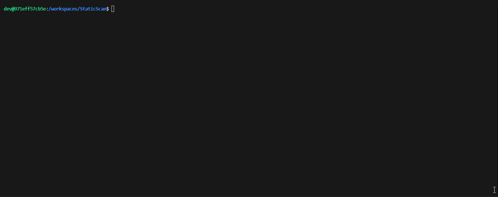

# Static Scan

Библиотека на C++20 для парсинга строк во время компиляции, вдохновленная `sscanf`. Этот проект предоставляет механизм для извлечения данных из строкового литерала в указанные типы на этапе компиляции, при этом вся логика валидации и парсинга выполняется компилятором.

## Ключевые особенности

- **Выполнение во время компиляции**: Весь парсинг и преобразование типов происходят на этапе компиляции, обеспечивая нулевые накладные расходы во время выполнения (`runtime`).
- **Типобезопасность**: Использует шаблоны и концепты C++ для обеспечения корректности типов. Ошибки в строке формата или несоответствие типов отлавливаются на этапе компиляции.
- **Простой синтаксис формата**:
    - `{}` или `{%s}`: парсинг в `std::string_view`.
    - `{%d}`: парсинг в знаковые целочисленные типы (например, `int`, `int64_t`).
    - `{%u}`: парсинг в беззнаковые целочисленные типы (например, `size_t`, `uint64_t`).
- **Современный C++**: Использует возможности C++20, такие как `consteval`, `std::string_view`, концепты и шаблонное метапрограммирование.

## Требования

- Компилятор, поддерживающий C++20 (например, GCC 10+, Clang 12+).
- CMake 3.16 или выше.

## Пример использования

Вот простой пример использования `Static Scan`:

```cpp
#include "scan.hpp"
#include <string_view>
#include <cstddef>

int main() {
    // Определяем строку формата и исходную строку во время компиляции
    constexpr auto fmt = "Пользователь: {}, ID: {%u}, Очки: {%d}"_fs;
    constexpr auto src = fixed_string{"Пользователь: Алиса, ID: 101, Очки: -50"};

    // Выполняем операцию сканирования
    constexpr auto result = stdx::scan<fmt, src, std::string_view, size_t, int>();

    // Получаем доступ к разобранным значениям и проверяем их во время компиляции
    static_assert(result.value<0>() == "Алиса");
    static_assert(result.value<1>() == 101);
    static_assert(result.value<2>() == -50);

    return 0;
}
```

Функция `stdx::scan` принимает строку формата и исходную строку в качестве шаблонных параметров. Типы, в которые необходимо выполнить парсинг, передаются как остальные аргументы шаблона. Результатом является объект `stdx::details::scan_result`, из которого можно получить значения по индексу с помощью метода `.value<N>()`. Все проверки выполняются во время компиляции с помощью `static_assert`.

## Сборка проекта и запуск тестов

Данный репозиторий использует **CMake** для сборки проекта.

### Команды для сборки проекта

Для сборки проекта выполните следующие команды из корневой директории:

```bash
mkdir build
cd build
cmake ..
make -j4
```

### Команда для запуска тестов

```bash
cd build
./scan_tests
```

